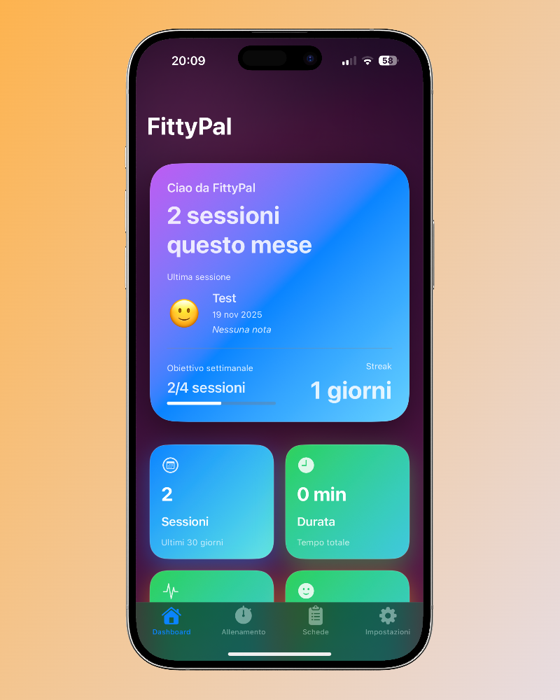

# FittyPal – La tua app professionale per l’allenamento


**FittyPal** è l’app progettata per atleti e personal trainer che vogliono allenarsi con precisione scientifica, organizzazione avanzata e zero compromessi sulla privacy.

## 🔥 Caratteristiche principali
- Creazione di **workout cards avanzate** (cluster, rest-pause, drop set, superserie).
- Libreria esercizi completa con foto, note e muscoli target.
- **Timer di esecuzione** intelligente per gestire recuperi e tecniche speciali.
- Monitoraggio **frequenza cardiaca via Bluetooth** con zone HR personalizzate.
- Storico allenamenti con **RPE**, umore, carichi e progressioni.
- Supporto multicliente per personal trainer.
- Integrazione sicura con **Apple Health**.




## 🔒 Privacy al primo posto
FittyPal non traccia, non invia e non archivia i tuoi dati su server esterni:
**tutto rimane esclusivamente sul tuo dispositivo.**

Porta i tuoi allenamenti al livello successivo.

---

## 📁 Project Structure

```text
FittyPal/
├── AppStoreMetadata/        # All App Store submission materials
│   ├── App-Review-Notes.md           # Complete reviewer guide
│   ├── App-Review-Notes-SHORT.txt    # Quick test guide (copy to ASC)
│   ├── Screenshot-Guide.md           # Screenshot creation guide
│   ├── Description_IT.md / EN.md     # App Store descriptions
│   ├── privacy-policy.html           # Privacy policy to host
│   ├── terms-of-use.html             # Terms of use
│   └── PRIVACY_HOSTING_INSTRUCTIONS.md
│
├── Screenshots/             # App Store screenshots (organized by device)
│   ├── Raw/                 # Original screenshots from iPhone
│   ├── iPhone-6.7/          # 1290x2796 processed screenshots
│   ├── iPhone-6.5/          # 1242x2688 processed screenshots
│   └── iPad-12.9/           # 2048x2732 processed screenshots
│
├── Documentation/           # Examples, diagrams, reference materials
│   └── example-screenshot.png
│
├── FittyPal/                # iOS app source code (Xcode project)
│   ├── Models/              # SwiftData models
│   ├── Views/               # SwiftUI views
│   ├── Services/            # HealthKit, Bluetooth managers
│   ├── Helpers/             # Utilities, themes, localization
│   └── Assets.xcassets/     # Images, icons, colors
│
├── FittyPal.xcodeproj/      # Xcode project file
├── SUBMISSION-CHECKLIST.md  # Complete App Store submission checklist
└── README.md                # This file
```

---

## 🚀 App Store Submission Status

**Current Status:** ✅ Ready for submission (95% complete)

**Completed:**
- ✅ Code quality & compliance (100%)
- ✅ Privacy manifest & descriptions
- ✅ App icons (28 variations)
- ✅ Localization (7 languages)
- ✅ App Store metadata prepared

**Remaining Tasks:**
1. Host privacy policy online → See `AppStoreMetadata/PRIVACY_HOSTING_INSTRUCTIONS.md`
2. Create screenshots → See `AppStoreMetadata/Screenshot-Guide.md`
3. Configure App Store Connect → See `SUBMISSION-CHECKLIST.md`
4. Build & submit → Archive in Xcode

**For complete submission guide, see:** `SUBMISSION-CHECKLIST.md`

---

## 🛠️ Technical Details

- **Platform:** iOS 17.0+
- **Language:** Swift 6.0
- **UI Framework:** SwiftUI
- **Persistence:** SwiftData
- **Localization:** 7 languages (IT, EN, ES, FR, PT, RU, DE)
- **Dependencies:** Zero external dependencies
- **Category:** Health & Fitness
- **Privacy:** 100% local, zero tracking

---

## 📚 Documentation

- `SUBMISSION-CHECKLIST.md` - Complete App Store submission guide
- `AppStoreMetadata/App-Review-Notes.md` - Instructions for Apple reviewers
- `AppStoreMetadata/Screenshot-Guide.md` - How to create App Store screenshots
- `Screenshots/README.md` - Screenshot organization guide
- `Documentation/README.md` - Additional reference materials

---

## 👨‍💻 Developer

**Lorenzo Franceschini**

- Support: [support@fittypal.com](mailto:support@fittypal.com)
- GitHub: [LordKenzo/FitnessDiary](https://github.com/LordKenzo/FitnessDiary)
- Website: [fittypal.com](https://www.fittypal.com)

---

## 📄 License

© 2025 Lorenzo Franceschini. All rights reserved.
